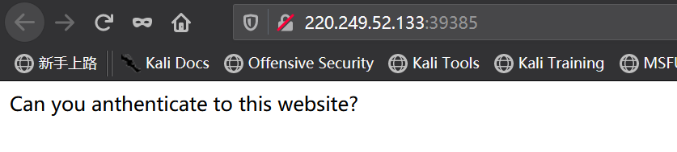
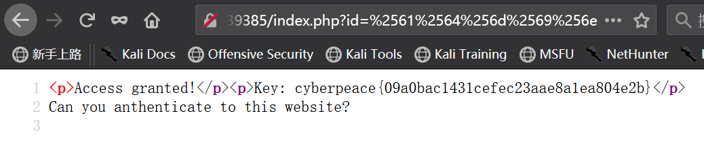

**简单的 `GET`和 `URL`加解码**

<!-- more -->

打开网页只有这



御剑扫描出 `index.php` 和 `indexs.php` 从网友那得知

> phps文件就是php的源代码文件，通常用于提供给用户（访问者）查看php代码，因为用户无法直接通过Web浏览器看到php文件的内容，所以需要用phps文件代替。其实，只要不用php等已经在服> 务器中注册过的MIME类型为文件即可，但为了国际通用，所以才用了phps文件类型。 它的MIME类型为：text/html, application/x-httpd-php-source,  application/x-httpd-php3-source。
>
> phps文件就是php的源代码文件，是给用户查看源代码的，无法接受变量传参，因为不能当做php进行解析，所以index.phps?id=是不行的，将s去掉即可

访问并查看index.phps的源代码

```php
<?php
if("admin"===$_GET[id]) {
  echo("<p>not allowed!</p>");
  exit();
}

$_GET[id] = urldecode($_GET[id]);
if($_GET[id] == "admin")
{
  echo "<p>Access granted!</p>";
  echo "<p>Key: xxxxxxx </p>";
}
?>

Can you anthenticate to this website?
```

从网友得知

> 双重编码，源码中第二行，第七行，第八行是关键，一开始给你框死不能满足admin,只要是admin，立刻退出。而第七行是`urldecode()`函数，是`url`编码解码函数但是你输入1次编码，直接给你变admin,你还是过不去，所以肯定是二次，二次编码后，浏览器还得在给你解一次，而且二次编码也很有趣，根据源码的定义，admin这单词任何一个字母，两个字母，三个字母等等，只要双重编码都可以绕过，当然你全部编码也可以。

在`burp`的`decoder`中进行编码

`admin` -> `%61%64%6d%69%6e` -> `%25%36%31%25%36%34%25%36%64%25%36%39%25%36%65`



由网址可见，浏览器确实进行了一次编码