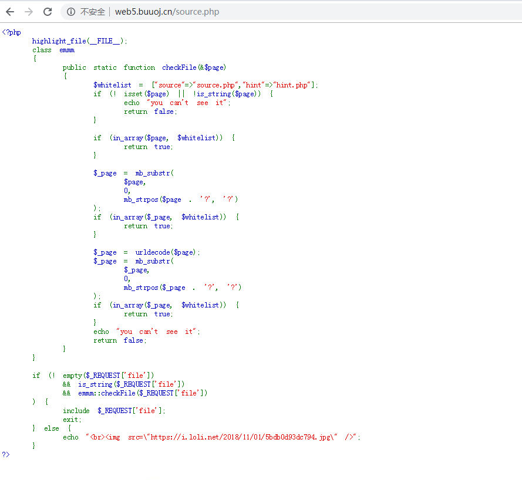

**phpmyadmin4.8.1远程文件包含漏洞（CVE-2018-12613）**
<!-- more -->
打开题目，看到页面

查看源码发现source.php
访问页面显示

发现个hint.php
访问后冒出一句话：flag not here, and flag in ffffllllaaaagggg
那么flag无疑就在ffffllllaaaagggg。那么问题来了，当前页面没有，如何让他蹦出来呢
'?'要两次url编码，strpos要截取'?'前的字符串并经过whitelist验证，然后就是目录穿越了，找到被包含的文件，
[**漏洞说明**]
<https://www.cnblogs.com/leixiao-/p/10265150.html>
<https://www.jianshu.com/p/0d75017c154f>

最后payload：url/source.php?file=source.php%253f/../../../../../../ffffllllaaaagggg

转载自<https://www.cnblogs.com/leixiao-/p/10265150.html>